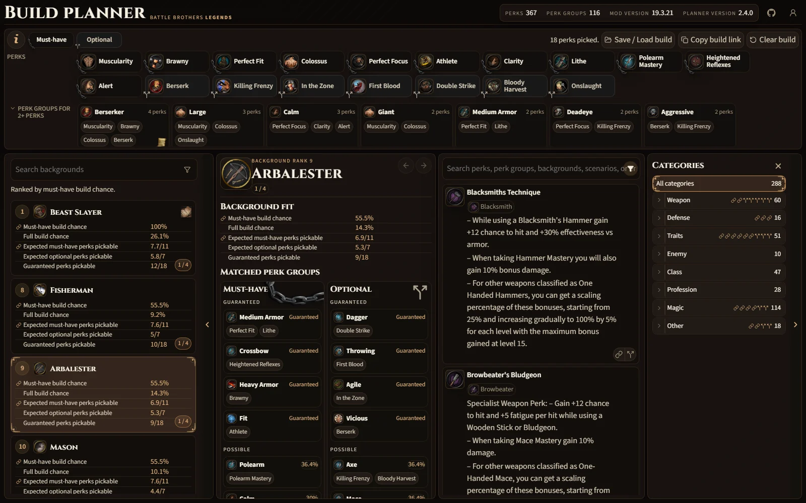

# Battle Brothers Legends mod build planner

[battlebrothers.academy](https://battlebrothers.academy/)

A compact build planner for the Battle Brothers Legends mod.

Use it to:

- Search the Legends perk catalog.
- Filter perks by category and perk group.
- Pick perks into a build and compare shared perk group coverage.
- Rank backgrounds against the current build.
- Inspect perk, perk group, and background details.
- Save, load, and share builds from the browser.

The planner uses Legends data, game icons, background rules, scenario sources, and dynamic perk group information to keep build planning fast and readable.
